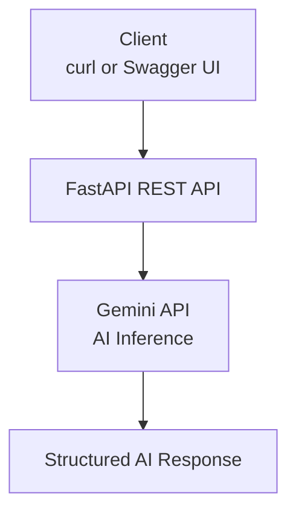

# AI-Powered-DevOps-Log-Analyzer
A lightweight FastAPI service that uses Google Gemini API to analyze DevOps logs and CI/CD errors and return AI-generated explanations and fixes.

This project demonstrates AI integration + DevOps practices, not ML model training.

---
## Tech Stack
- FastAPI (REST API)
- Google Gemini API (LLM inference)
- Docker & Docker Compose
- Python 3.12
- Pytest

---

## Project Stucture
```
.
├── docker-compose.yaml
├── Dockerfile
├── main.py
├── requirements.txt
├── tests/
│   └── test_health.py
└── README.md
```

---
## Project Architecture


---

## Setup

### Environment
```
export GEMINI_API_KEY="your_api_key_here"
```

### Run Locally
```
pip install -r requirements.txt
uvicorn main:app --reload
```

Open: `http://127.0.0.1:8000/docs`

### Run with Docker
```
docker build -t ai-devops-analyzer .
docker run -p 8000:8000 -e GEMINI_API_KEY=xxx ai-devops-analyzer
```

---

## API Usage
### Endpoint
```
POST /analyze
```

### Example Request
```
{
  "category": "ci_error",
  "content": "failed to fetch oauth token from docker.io"
}
```

### Example Response
```
{
  "analysis": "The error indicates a network or DNS issue while accessing Docker Hub..."
}
```
